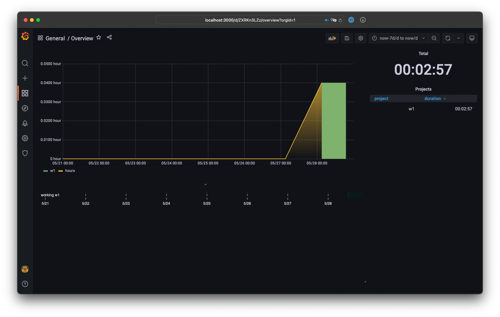
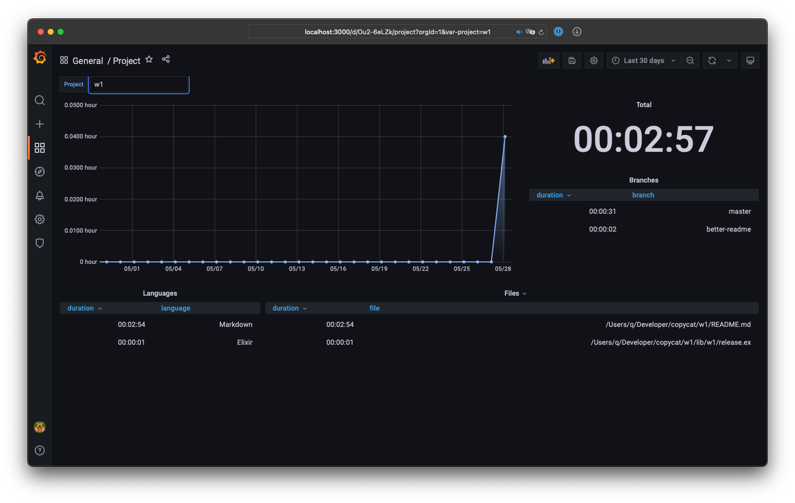

### WakaTime with Grafana

This repo contains a docker-compose setup to run a local bootleg of [WakaTime.](https://wakatime.com) It's composed of postgres, grafana, and a heartbeats ingester. Both grafana state and heartbeats are stored in postgres. "Overview" and "project" dashboards are imported into grafana on startup.

#### How-To:

```sh
# run postgres, grafana, and heartbeats ingester in background
> docker-compose up -d

# make wakatime send heartbeats to the local heartbeats ingester
# ingester port can be changed in docker-compose.yml
# api_key can be any lowercased uuid
> cat > ~/.wakatime.cfg << EOM
[settings]
api_url = http://localhost:4000
api_key = 406fe41f-6d69-4183-a4cc-121e0c524c2b
EOM

# open grafana
# default creds:
# username: admin
# password: admin
# grafana port can be changed in docker-compose.yml
> open http://localhost:3000

# to stop postgres, grafana, and heartbeats ingester
> docker-compose down
```

#### Overview dashboard



#### Project dashboard


